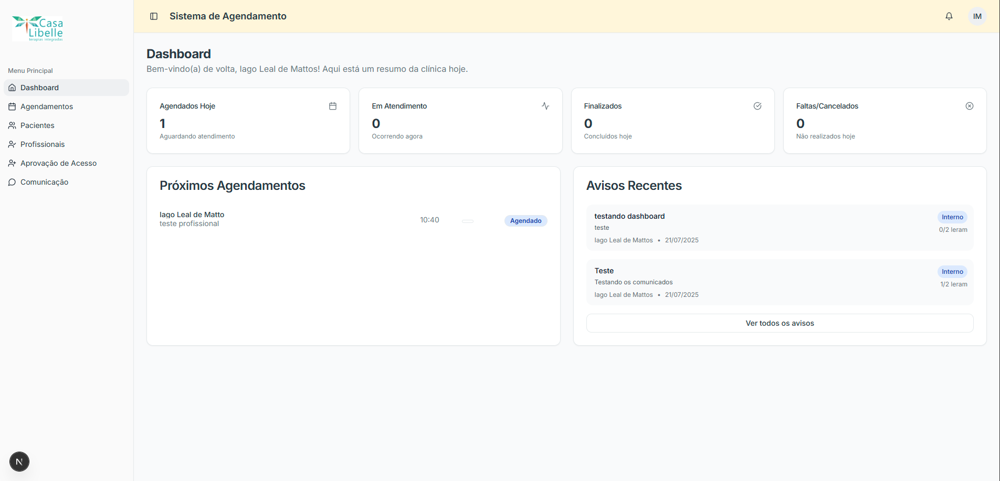

Sistema de Gestão Clínica - Casa Libelle
Uma solução moderna e completa para a gestão de clínicas de terapia, construída com as tecnologias mais recentes para garantir performance, escalabilidade e uma excelente experiência de usuário.

📸 Visão Geral do Projeto

O Sistema de Gestão Clínica - Casa Libelle é uma aplicação web robusta projetada para centralizar e otimizar todas as operações de uma clínica de terapias. Desde o gerenciamento de pacientes e profissionais até o agendamento complexo e a comunicação interna, o sistema visa reduzir a carga administrativa e permitir que os profissionais foquem no que realmente importa: o cuidado com o paciente.

✨ Funcionalidades Principais
🔐 Autenticação Segura: Sistema de login e cadastro com papéis de usuário (Admin, Funcionário, Profissional, Familiar) e fluxo de aprovação de contas.

📊 Dashboard de Admin: Visão geral da clínica com estatísticas dinâmicas sobre pacientes, profissionais e agendamentos.

🧑‍⚕️ Dashboard de Profissional: Área personalizada para cada profissional visualizar sua agenda do dia e comunicados importantes.

👥 Gestão de Pacientes (CRUD): Cadastro, visualização, edição e arquivamento de perfis de pacientes.

👨‍💼 Gestão de Profissionais (CRUD): Gerenciamento completo dos profissionais da clínica, incluindo dados pessoais, financeiros e de atendimento.

🗓️ Agenda Inteligente:

Criação de agendamentos únicos e em lote (recorrentes).

Visualização diária por profissional e período (manhã, tarde, noite).

Atualização de status dos atendimentos (Agendado, Finalizado, Em Atendimento, etc.).

♻️ Avisos de Renovação: Sistema proativo que notifica sobre blocos de agendamento que estão perto do fim, com opção de renovação interativa.

📢 Comunicação Interna: Mural de avisos direcionado por papel de usuário.

... e muito mais planejado para o futuro, incluindo um módulo financeiro completo!

🚀 Stack de Tecnologia
Este projeto foi construído utilizando um stack moderno e performático, focado em boas práticas de desenvolvimento e escalabilidade.

Framework: Next.js (com App Router)

Linguagem: TypeScript

Backend & Banco de Dados: Firebase (Authentication e Cloud Firestore)

UI & Estilização: Tailwind CSS com shadcn/ui para componentes

Estado Global: React Context API (focado em autenticação)

Validação de Formulários: (Ex: react-hook-form com zod) - se estiver usando

Manipulação de Datas: date-fns

🏛️ Arquitetura e Padrões
A qualidade do código e a manutenibilidade são prioridades. Por isso, seguimos padrões de arquitetura bem definidos:

Client-Side Data Fetching: Para contornar limitações de permissões do Firebase no servidor, as páginas renderizam um componente de cliente que é responsável por buscar os dados via useEffect. Isso mantém a segurança e a reatividade.

Service Layer (Camada de Serviço): Toda a lógica de comunicação com o Firestore está encapsulada em services (ex: appointmentService.ts). Os componentes da UI nunca falam diretamente com o banco de dados, promovendo a separação de responsabilidades.

Proteção de Rotas: Um AuthGuard robusto envolve os layouts protegidos, gerenciando o estado de autenticação e redirecionando usuários com base em seu status e papel.

Otimização de Custos (Firestore): Implementação de desnormalização de dados para reduzir drasticamente o número de leituras em operações comuns, garantindo que a aplicação se mantenha no plano gratuito do Firebase pelo maior tempo possível.

🔥 Como Rodar o Projeto Localmente
Siga os passos abaixo para configurar e rodar o projeto em seu ambiente de desenvolvimento.

Pré-requisitos
Node.js (versão 18 ou superior)

npm, yarn ou pnpm

1. Clone o Repositório
Bash

git clone [\[URL_DO_SEU_REPOSITORIO_GIT\]](https://github.com/IagoLeal1/GestaoLibelle.git)
cd casa-libelle-sistema
2. Instale as Dependências
Bash

npm install
# ou
yarn install
# ou
pnpm install
3. Configure as Variáveis de Ambiente
Crie um arquivo chamado .env.local na raiz do projeto. Ele guardará suas chaves do Firebase.

Importante: Este arquivo nunca deve ser enviado para o repositório Git.

Bash

# .env.local

# Suas credenciais do projeto Firebase
# Você pode encontrá-las nas configurações do seu projeto no console do Firebase
NEXT_PUBLIC_FIREBASE_API_KEY="AIza..."
NEXT_PUBLIC_FIREBASE_AUTH_DOMAIN="seu-projeto.firebaseapp.com"
NEXT_PUBLIC_FIREBASE_PROJECT_ID="seu-projeto"
NEXT_PUBLIC_FIREBASE_STORAGE_BUCKET="seu-projeto.appspot.com"
NEXT_PUBLIC_FIREBASE_MESSAGING_SENDER_ID="..."
NEXT_PUBLIC_FIREBASE_APP_ID="1:..."
4. Rode o Servidor de Desenvolvimento
Bash

npm run dev
Abra http://localhost:3000 em seu navegador para ver o resultado.

📁 Estrutura de Pastas (Simplificada)
/
├── app/                  # Rotas principais (App Router)
│   ├── (auth)/           # Rotas de autenticação (login, signup)
│   └── (dashboard)/      # Rotas protegidas após o login
├── components/           # Componentes React reutilizáveis
│   ├── auth/
│   ├── dashboards/
│   ├── forms/
│   ├── modals/
│   ├── pages/            # Componentes de cliente para cada página
│   └── ui/               # Componentes do shadcn/ui
├── context/              # Contextos React (ex: AuthContext)
├── services/             # Lógica de backend (interação com Firebase)
├── lib/                  # Arquivos de configuração (Firebase, utils)
└── ...
📄 Licença
Este projeto está sob a licença MIT. Veja o arquivo LICENSE para mais detalhes.

👨‍💻 Autor
Feito com ❤️ por Iago Leal de Mattos

GitHub: @IagoLeal1
